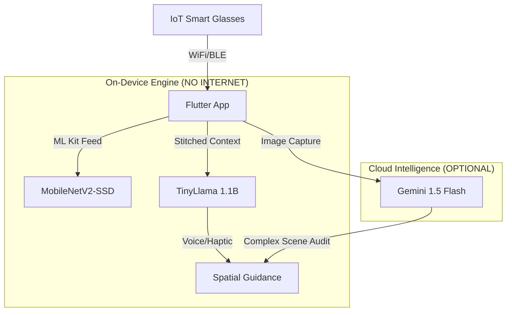

# 🌐 EasyLens — Redefining Vision Through AI & IoT

**EasyLens** is a sophisticated assistive navigation solution designed to provide visually impaired users with real-time, AI-driven environmental awareness. By integrating a mobile application with specialized IoT smart glasses, EasyLens acts as a digital companion, translating the visual world into understandable audio guidance and high-contrast visual cues.

---

## 💎 Our Core Values

| 🧗 Independence | 🛡️ Safety | ♿ Accessibility |
| :--- | :--- | :--- |
| Empowering users to navigate unfamiliar environments without constant human assistance. | Prioritizing hazard detection to prevent accidents from stairs, vehicles, and obstacles. | Born from the ground up to follow strict accessibility principles (WCAG) for seamless interaction. |

---

## 🚀 Project Overview

EasyLens bridges the gap between digital intelligence and physical navigation. The system consists of a high-performance Flutter mobile application that leverages **Google ML Kit** for on-device vision processing and **Cloudflare R2** for efficient asset hosting, providing a seamless "connected" experience for the visually impaired.

---

### 🤖 First-in-Class Offline AI
- **On-Device LLM:** Integrated **TinyLlama 1.1B** (GGUF) for 100% private, offline generative reasoning. No data leaves the device.
- **Smart Vision Context:** The AI is fed real-time ML Kit labels to "see" your environment and answer questions like "What is in front of me?" or "Who is that?".
- **Clock-Face Directions:** Provides spatial audio descriptions using the clock method (e.g., "Doorway at 2 o'clock, 5 steps ahead").

### 👁️ Dual-API Vision System
- **Real-Time Detection:** Native Google ML Kit Object Detection providing tight bounding boxes and persistent tracking IDs.
- **Granular Classification:** Integrated Image Labeling API identifying **400+ specific objects** (e.g., "Laptop", "Chair", "Beverage").
- **Optimized MobileNet:** Uses an enhanced **MobileNetV2-SSD** pipeline with confidence-sorting to prioritize critical hazards (stairs, vehicles).

### 💬 Assistant UI v2 & Chat
- **Slide-to-Hide Mic:** A new draggable assistant button that "docks" to the screen edges to free up visual space.
- **Dedicated Chat Screen:** A full conversational interface for complex inquiries, accessible via the new 4th navigation tab.
- **Processing Overlays:** Professional blur-filter "Thinking..." states to prevent race conditions and improve UX flow.

### 🗺️ Navigation & Haptic Hub
- **Vibration Navigation:** A unique haptic system that pulses in the direction of the next turn, allowing for "blind" directional guidance.
- **Smart Routing:** Pedestrian-first paths powered by **OSRM** and **Photon** geocoding.

---

## 🏗️ System Architecture

EasyLens utilizes a decoupled service-layer architecture to ensure stability across vision and navigation tasks.

### 🔄 Data Flow Protocol

```mermaid
graph TD
    Glasses[IoT Smart Glasses] -->|WiFi/BLE| App[Flutter App]
    subgraph "On-Device Engine (NO INTERNET)"
        App -->|ML Kit Feed| MobileNet[MobileNetV2-SSD]
        App -->|Stitched Context| TinyLlama[TinyLlama 1.1B]
        TinyLlama -->|Voice/Haptic| Audio[Spatial Guidance]
    end
    subgraph "Cloud Intelligence (OPTIONAL)"
        App -->|Image Capture| Gemini[Gemini 1.5 Flash]
        Gemini -->|Complex Scene Audit| Audio
    end
```

### 🧠 MobileNetV2 SSD Optimization
The detection pipeline is specifically tuned for lower-tier Android hardware:
- **Depthwise Separable Convolutions:** Reduces parameters and mathematical operations by ~8x compared to standard CNNs.
- **INT8 Quantization:** Through POST-training quantization, the model footprint is reduced to <5MB while maintaining 90%+ of FP32 precision.

---

## 🛠️ Technology Stack

| Category | Technology |
| :--- | :--- |
| **Foundation** | [Flutter](https://flutter.dev) / [Dart](https://dart.dev) |
| **Offline LLM** | **TinyLlama 1.1B** (llama_flutter_android) |
| **Deep Vision** | **MobileNetV2 SSD** (ML Kit & TFLite) |
| **Generative AI**| **Gemini 1.5 Flash** (Hybrid Mode) |
| **Navigation** | **OSRM** (Routing) & **Photon** (Geocoding) |
| **Backend** | [Firebase](https://firebase.google.com) & [Cloudflare R2](https://www.cloudflare.com/products/r2/) |
| **IoT Control**| Bluetooth Low Energy (BLE) & WiFi TCP Stream |

---

## 🏁 Roadmap to Production

- [x] **Phase 1: Foundation** — UI System, Firebase Auth, and Theme Engine.
- [x] **Phase 2: Vision Core** — Google ML Kit and **MobileNetV2 SSD** integration.
- [x] **Phase 3: Offline Brain** — **TinyLlama 1.1B** integration for private AI assist.
- [x] **Phase 4: Assistant UI v2** — Slide-to-hide Mic and Chatbot Screen.
- [/] **Phase 5: Navigation** — OSRM Pedestrian Routing and Vibration Navigation.
- [ ] **Phase 6: Hardware Sync** — WiFi streaming from physical ESP32-CAM Smart Glasses.

---

## 📖 Usage Guide

1. **Dashboard:** ML Kit labels the world. Double-tap the "Radar" for a verbal summary.
2. **AI Assist:** Long-press the Mic (or drag it to side to hide) to ask "What do you see?".
3. **Chat:** Use the 4th tab to type or talk with EasyLens in a conversational thread.
4. **Navigation:** Search for a destination; follow the haptic pulses for directional turns.

---

## 🤝 Contributing

We are building EasyLens to be the open-standard for assistive vision tech.
- **Vision:** Help us expand the `MlKitLabelMap` for better object filtering.
- **UX/UI:** Optimize the high-contrast patterns for specific visual conditions like Glaucoma or Cataracts.

---
*Created with ❤️ for a more accessible world.*

