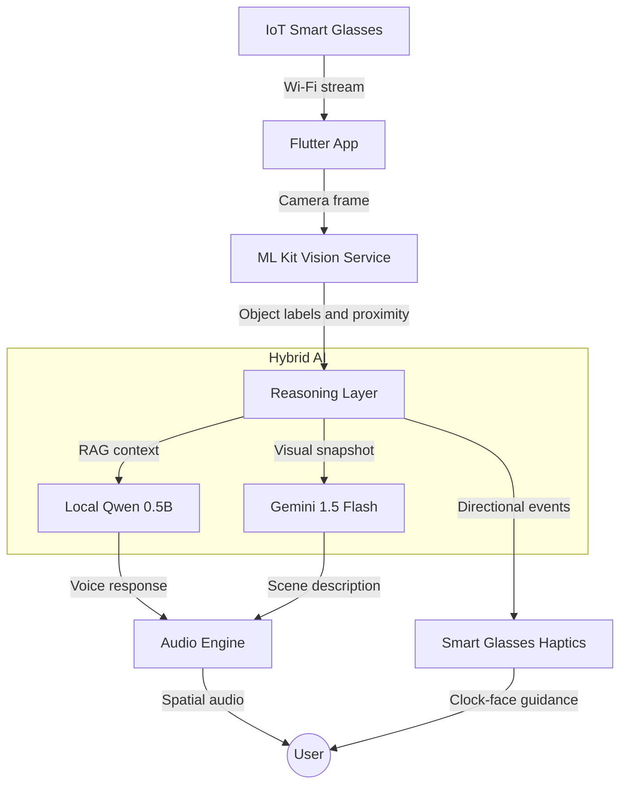

# EasyLens

Assistive navigation for visually impaired users, built with Flutter, on-device vision, local AI, and smart-glasses hardware integration.

[](https://flutter.dev)
[](https://dart.dev)
[](https://developers.google.com/ml-kit)
[](https://firebase.google.com)
[](https://www.cloudflare.com/products/r2/)
[](https://deepmind.google/technologies/gemini/)
[](https://github.com/QwenLM/Qwen)

EasyLens turns camera input into spoken guidance, haptic feedback, and navigation cues. The app is designed around a simple goal: help users understand what is around them without depending entirely on cloud services or another person.

The prototype combines a Flutter mobile app, Google ML Kit, TensorFlow Lite object detection, a local Qwen model, Gemini scene analysis, Firebase, Cloudflare R2, and simulated smart-glasses communication.

---

## What EasyLens does

- Detects nearby objects and hazards through the phone camera.
- Gives directional guidance using clock-face language, such as "door at 2 o'clock."
- Provides voice assistance through a dedicated chat and command interface.
- Supports offline reasoning with a local Qwen 0.5B model.
- Uses Gemini for richer scene descriptions when cloud access is available.
- Connects to the smart-glasses layer through simulated BLE/haptic events.
- Stores profile and user metadata with Firebase and Cloudflare R2.

---

## Design priorities

### Independence

EasyLens is built to keep useful features available even when the network is weak or unavailable. Local object detection and the offline LLM help reduce dependence on cloud APIs.

### Safety

The vision pipeline focuses on practical hazards: stairs, curbs, vehicles, crowded paths, and other obstacles that affect mobility.

### Accessible interface

The UI uses high-contrast visuals, large touch targets, screen-reader support, and progressive disclosure so users are not overloaded with too much information at once.

---

## Core features

### On-device AI

- Local Qwen 0.5B model through `llama_flutter_android`.
- Built-in retrieval flow for project-specific and contextual answers.
- Offline fallback when Gemini is unavailable.

### Vision pipeline

- Google ML Kit object detection for fast frame-level tracking.
- TensorFlow Lite MobileNet SSD models for object classification.
- Hazard mapping for stairs, vehicles, path obstructions, and negative obstacles.

### Assistant HUD

- Draggable microphone control that can dock to screen edges.
- Chat hub for longer questions and voice-assisted interaction.
- Haptic context system for objects, hazards, and navigation feedback.

### Navigation

- OSRM for route calculation.
- Photon/Komoot for destination search.
- Clock-face direction language for spatial orientation.

### Smart-glasses prototype

- Wi-Fi camera stream from the glasses layer to the phone.
- BLE-style telemetry and haptic alerts, currently simulated in the prototype.

---

## Architecture


```mermaid
graph TD
    Glasses[IoT Smart Glasses] -->|Wi-Fi stream| App[Flutter App]
    App -->|Camera frame| MLKit[ML Kit Vision Service]
    MLKit -->|Object labels and proximity| Logic[Reasoning Layer]

    subgraph "Hybrid AI"
        Logic -->|RAG context| Qwen[Local Qwen 0.5B]
        Logic -->|Visual snapshot| Gemini[Gemini 1.5 Flash]
    end

    Qwen -->|Voice response| TTS[Audio Engine]
    Gemini -->|Scene description| TTS
    Logic -->|Directional events| Haptics[Smart Glasses Haptics]

    TTS -->|Spatial audio| User((User))
    Haptics -->|Clock-face guidance| User
```

---

## Tech stack

| Category | Technology | Purpose |
| :--- | :--- | :--- |
| App framework | Flutter / Dart | Cross-platform mobile app |
| State management | Provider | App state and navigation state |
| Local LLM | Qwen 0.5B GGUF | Offline reasoning and RAG |
| LLM runtime | llama_flutter_android | On-device model execution |
| Cloud LLM | Gemini 1.5 Flash | Scene analysis and richer responses |
| Object detection | Google ML Kit | Real-time object tracking |
| Custom vision | TensorFlow Lite / MobileNet SSD | Local object classification |
| Maps | flutter_map, OSRM, Photon | Routing and destination search |
| Location | geolocator, geocoding | User position and geocoding |
| Auth and data | Firebase Auth, Firestore | User accounts and metadata |
| Asset storage | Cloudflare R2 | Profile images and uploaded assets |
| Voice | speech_to_text, flutter_tts | Speech commands and audio output |
| Hardware layer | Simulated BLE / haptics | Smart-glasses communication prototype |

---

## Project status

- [x] Phase 1: App foundation, UI framework, Firebase setup
- [x] Phase 2: ML Kit and MobileNet SSD vision pipeline
- [x] Phase 3: Local Qwen 0.5B model with RAG support
- [x] Phase 4: Assistant HUD, draggable mic, and chat screen
- [ ] Phase 5: Navigation refinements with OSRM and Photon
- [ ] Phase 6: Production-ready smart-glasses hardware
- [ ] Phase 7: Community features and custom object naming

---

## Local setup

### Prerequisites

- Flutter installed
- Dart SDK `^3.6.0`
- Android Studio or Xcode for device builds
- Firebase project credentials
- Cloudflare R2 bucket credentials
- Gemini API key

### Install dependencies

```bash
flutter pub get
```

### Add environment variables

Create a `.env` file in the project root:

```env
GEMINI=your_gemini_api_key

FIREBASE_API_KEY=your_firebase_api_key
FIREBASE_APP_ID=your_firebase_app_id
FIREBASE_MESSAGING_SENDER_ID=your_sender_id
FIREBASE_PROJECT_ID=your_project_id
FIREBASE_STORAGE_BUCKET=your_storage_bucket

FIREBASE_WEB_API_KEY=your_web_api_key
FIREBASE_WEB_APP_ID=your_web_app_id
FIREBASE_WEB_AUTH_DOMAIN=your_web_auth_domain
FIREBASE_WEB_MEASUREMENT_ID=your_web_measurement_id

ACCOUNT_ID=your_cloudflare_account_id
ACCESS_KEY_ID=your_r2_access_key_id
SECRET_ACCESS_KEY=your_r2_secret_access_key
BUCKET_NAME=your_bucket_name
S3_API=your_optional_public_r2_endpoint
```

### Add local models

The app already references TensorFlow Lite assets in `assets/models/`. If you are using the local LLM flow, place the Qwen GGUF model in the expected model path used by the local LLM service.

### Run the app

```bash
flutter run
```

### Run tests

```bash
flutter test
```

---

## Repository notes

- Main app entry point: `lib/main.dart`
- ML Kit processing: `lib/services/mlkit_processor.dart`
- Local LLM service: `lib/services/local_llm_service.dart`
- Gemini service: `lib/services/gemini_service.dart`
- Navigation provider: `lib/providers/navigation_provider.dart`
- Chat UI: `lib/screens/main/chat_screen.dart`

---

## Acknowledgments

- Qwen team for efficient small language models.
- Google ML Kit for mobile vision tooling.
- OSRM and Photon for open routing and geocoding tools.
- Flutter and Firebase teams for the app foundation.
