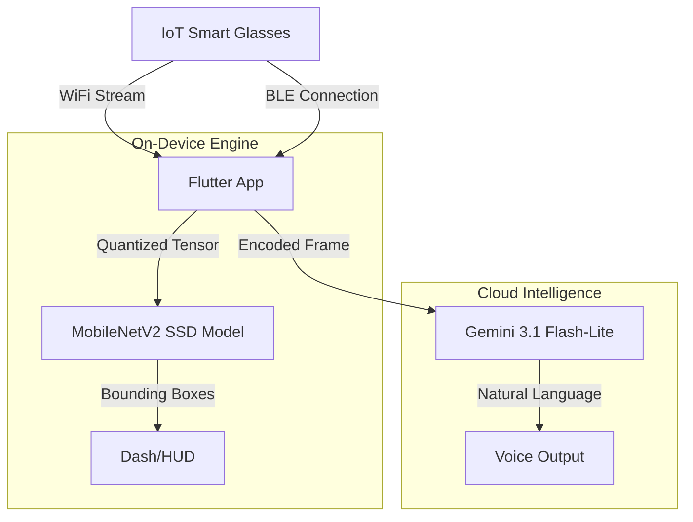

# 🌐 EasyLens — Redefining Vision Through AI & IoT

**EasyLens** is a sophisticated assistive navigation solution designed to provide visually impaired users with real-time, AI-driven environmental awareness. By integrating a mobile application with specialized IoT smart glasses, EasyLens acts as a digital companion, translating the visual world into understandable audio guidance and high-contrast visual cues.

---

## 💎 Our Core Values

| 🧗 Independence | 🛡️ Safety | ♿ Accessibility |
| :--- | :--- | :--- |
| Empowering users to navigate unfamiliar environments without constant human assistance. | Prioritizing hazard detection to prevent accidents from stairs, vehicles, and obstacles. | Born from the ground up to follow strict accessibility principles (WCAG) for seamless interaction. |

---

## 🚀 Project Overview

EasyLens bridges the gap between digital intelligence and physical navigation. The system consists of a high-performance Flutter mobile application that leverages **Google ML Kit** for on-device vision processing and **Cloudflare R2** for efficient asset hosting, providing a seamless "connected" experience for the visually impaired.

---

## ✨ Key Features

### 👁️ Dual-API Vision System
- **Real-Time Detection:** Native Google ML Kit Object Detection providing tight bounding boxes and persistent tracking IDs.
- **Granular Classification:** Integrated Image Labeling API identifying **400+ specific objects** (e.g., "Laptop", "Chair", "Beverage") instead of generic categories.
- **Compound Labeling:** Intelligently combines base categories with specific semantic names (e.g., "Home Good - Laptop").

### 🗺️ Navigation Hub
- **Smart Search:** Search for destinations with Google Maps integration.
- **Historical Tracking:** Quick access to "Recent Destinations" for repeated routes.
- **Visual Guidance:** High-contrast directions and "Start Navigation" triggers with haptic feedback.

### 👤 Profile & Cloud Sync
- **Identity Management:** Secure Firebase Authentication (Login/Signup/Password Reset).
- **Photo Hosting:** User profile pictures are hosted on **Cloudflare R2** via S3-compatible APIs for high performance and scalability.
- **Preferences:** Personalized setup for "Visual Condition" and "Language" (English/Filipino).

### 📡 IoT Connectivity
- **BLE Synergy:** Reactive Bluetooth Low Energy (BLE) status monitoring for seamless pairing with IoT Smart Glasses.
- **Hazard Alerts:** (Experimental) Special detection tracks for common hazards like stairs and vehicles.

### 👁️ Intelligence Layer
- **Core Model:** Powered by a customized **MobileNetV2-SSD** (Single Shot MultiBox Detector) quantized for INT8 performance. This allows for rapid, simultaneous detection and classification of multiple objects directly on the mobile device's NPU/DSP.
- **Generative Insight:** Integrates **Gemini 3.1 Flash-Lite** for complex scene understanding. When a user asks a specific question (e.g., "What is written on that sign?"), the app captures a high-resolution frame and leverages Gemini to provide a 1-2 sentence descriptive breakdown.

### 📡 Hybrid IoT Connectivity
EasyLens uses a "Dual-Link" communication strategy to balance power efficiency and data bandwidth:
- **WiFi (High Bandwidth):** Used for real-time high-resolution camera frame streaming from the Smart Glasses to the application.
- **BLE (Control/Status):** A persistent Bluetooth Low Energy link handles pairing, device status, battery telemetry, and immediate haptic trigger signals.

---

## 🏗️ System Architecture

EasyLens utilizes a decoupled service-layer architecture to ensure stability across vision and navigation tasks.

### 🔄 Data Flow Protocol

```mermaid
graph TD
    Glasses[IoT Smart Glasses] -->|WiFi Stream| App[Flutter App]
    Glasses -->|BLE Connection| App
    subgraph "On-Device Engine"
        App -->|Quantized Tensor| MobileNet[MobileNetV2 SSD Model]
        MobileNet -->|Bounding Boxes| UI[Dash/HUD]
    end
    subgraph "Cloud Intelligence"
        App -->|Encoded Frame| Gemini[Gemini 3.1 Flash-Lite]
        Gemini -->|Natural Language| Audio[Voice Output]
    end
```

### 🧠 MobileNetV2 SSD Optimization
The detection pipeline is specifically tuned for lower-tier Android hardware:
- **Depthwise Separable Convolutions:** Reduces parameters and mathematical operations by ~8x compared to standard CNNs.
- **INT8 Quantization:** Through POST-training quantization, the model footprint is reduced to <5MB while maintaining 90%+ of FP32 precision.

---

## 🛠️ Technology Stack

| Category | Technology |
| :--- | :--- |
| **Foundation** | [Flutter](https://flutter.dev) / [Dart](https://dart.dev) |
| **Edge Vision** | **MobileNetV2 SSD** via Google ML Kit / TFLite |
| **Generative AI**| **Gemini 3.1 Flash-Lite** (Google Generative AI SDK) |
| **Backend** | [Firebase](https://firebase.google.com) (Auth, Firestore) |
| **Cloud Storage** | [Cloudflare R2](https://www.cloudflare.com/products/r2/) (S3-Compatible Object Storage) |
| **IoT Control**| Bluetooth Low Energy (BLE) |
| **Data Stream** | High-Speed WiFi (TCP/UDP Stream) |
| **State** | [Provider](https://pub.dev/packages/provider) |

---

## 🏁 Roadmap to Production

- [x] **Phase 1: Foundation** — UI System, Firebase Auth, and Theme Engine.
- [x] **Phase 2: Vision Core** — Google ML Kit Dual-API and **MobileNetV2 SSD** integration.
- [x] **Phase 3: Deep Context** — **Gemini 3.1 Flash** integration for scene auditing.
- [x] **Phase 4: Cloud Sync** — Cloudflare R2 Profile Photo hosting and Firestore Metadata.
- [/] **Phase 5: Navigation** — Full Turn-by-Turn integration and Google Maps Sync.
- [ ] **Phase 6: Hardware Sync** — Real-time WiFi streaming from physical ESP32-CAM Smart Glasses.

---

## 📖 Usage Guide

1. **Environmental Scan:** Open the Dashboard; ML Kit automatically draws and labels objects in view.
2. **Navigation:** Swipe to the Navigation tab to search for destinations or re-trace recent routes.
3. **Connectivity:** Pair your glasses via the Devices tab; the "Active" badge indicates data flow.
4. **Profile:** Manage your visual condition and profile aesthetics in the Profile View.

---

## 🤝 Contributing

We are building EasyLens to be the open-standard for assistive vision tech.
- **Vision:** Help us expand the `MlKitLabelMap` for better object filtering.
- **UX/UI:** Optimize the high-contrast patterns for specific visual conditions like Glaucoma or Cataracts.

---
*Created with ❤️ for a more accessible world.*

