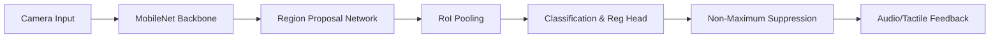

# 🌐 EasyLens — Redefining Vision Through AI & IoT

**EasyLens** is a sophisticated assistive navigation solution designed to provide visually impaired users with real-time, AI-driven environmental awareness. By integrating a mobile application with specialized IoT smart glasses, EasyLens acts as a digital companion, translating the visual world into understandable audio guidance.

---

## 💎 Our Core Values

| 🧗 Independence | 🛡️ Safety | ♿ Accessibility |
| :--- | :--- | :--- |
| Empowering users to navigate unfamiliar environments without constant human assistance. | Prioritizing hazard detection to prevent accidents from stairs, vehicles, and obstacles. | Born from the ground up to follow strict accessibility principles for seamless interaction. |

---

## 🚀 Project Overview

EasyLens bridges the gap between digital intelligence and physical navigation. The system consists of a high-performance Flutter mobile application linked via Bluetooth (BLE) to a pair of IoT smart glasses equipped with cameras and sensors.

### ✨ Key Features
- **🧠 Edge AI Processing:** Local inference for near-zero latency and total data privacy.
- **🗣️ Multilingual Voice:** Real-time translations into **English** and **Filipino**, tailored for local context.
- **📡 BLE Synergy:** Persistent, low-energy connection to smart glasses hardware.
- **🚨 Emergency Guardian:** Rapid-trigger emergency protocol with haptic feedback and contact alerts.
- **🎨 High-Contrast UI:** Glassmorphism-inspired design optimized for low-vision readability.

---

## 🏗️ System Architecture & Implementation

### The Service Layer
EasyLens utilizes a decoupled service-layer architecture to ensure scalability and reliability:

- **AI Inference Engine:** A TFLite-ready pipeline (currently simulated) that classifies objects into danger categories.
- **NLP Audio Formatter:** A localization layer that converts raw detection data into natural, human-like sentences.
- **IoT Connectivity Service:** Manages BLE life cycles, bonding, and data streaming between the app and the glasses.
- **Haptic Feedback Service:** Provides tactile confirmation for all UI interactions, essential for visually impaired users.

---

## 🧠 Object Detection Framework

EasyLens utilizes a high-precision, two-stage object detection architecture optimized for real-time inference on power-constrained wearable devices.

### 🛠️ Architecture Overview
The detection pipeline is designed to balance accuracy and latency, ensuring safe navigation in dynamic environments like busy streets or uneven terrain.

### 🛰️ Core Components

#### 1. MobileNet Backbone
The system employs **MobileNet** for feature extraction. MobileNet factorizes standard convolutions into **depthwise separable convolutions** to significantly reduce computational overhead.

*   **Standard Convolution:** $D_k \times D_k \times M \times N$
*   **MobileNet Factorization:** $Depthwise + Pointwise\ Convolution$
*   **Efficiency:** Reduces parameters and FLOPS by ~8-9x compared to standard CNNs.
*   **Latency:** Optimized for edge hardware (Snapdragon/Apple Silicon/ARM).

#### 2. Region Proposal Network (RPN)
To ensure hazards like stairs, open canals, and small obstacles are not missed, a dedicated RPN generates candidate bounding boxes.
*   **Anchor Boxes:** Evaluates multiple aspect ratios and scales at each spatial location.
*   **Loss Function:** Optimized using a balanced approach: $L = L_{cls} + \lambda L_{reg}$

#### 3. INT8 Quantization
The model is converted from **FP32 (32-bit floating point)** to **INT8 (8-bit integer)** using Post-Training Quantization (PTQ).

$$FP32\ Weights \rightarrow INT8\ Representation$$

*   **4x Smaller:** Significantly reduces the deployment footprint.
*   **3x Faster:** Accelerates inference on mobile NPUs and DSPs.
*   **Power Efficient:** Extends battery life for wearable usage.

### 🎯 Training Strategy
The framework is fine-tuned using **Transfer Learning** on a curated hazard dataset, featuring data augmentation for motion blur, low-light simulation, and urban clutter.

---

## 📊 Technical Diagrams

### 🗺️ System Architecture

### 🔄 Data Flow Protocol

### 🔗 Interface Relationship (ERD)

---

## 🛠️ Technology Stack

| Technology | Purpose |
| :--- | :--- |
| **Flutter / Dart** | Cross-platform mobile foundation |
| **Provider** | Reactive state management |
| **Flutter TTS** | Voice feedback synchronization |
| **Bluetooth LE** | Low-latency hardware communication |
| **TensorFlow Lite** | (Future) On-device machine learning |

---

## 🏁 Roadmap to Production

- [x] **Phase 1: Prototype** — Foundation, UI System, and Simulated Services.
- [ ] **Phase 2: Hardware Sync** — Integration with Physical ESP32/Pi Smart Glasses.
- [ ] **Phase 3: Intelligence** — Implementation of Real-time TFLite detection models.
- [ ] **Phase 4: Global Reach** — Support for more local dialects and improved NLP.

---

## 📖 Usage Guide

1. **Dashboard Home:** Large radar button triggers an environmental scan.
2. **Navigation Hub:** High-contrast buttons for repeatable instructions and emergency alerts.
3. **Settings Console:** Toggle between English/Filipino and manage your Smart Glasses connection.
4. **IoT Interaction:** Watch the Bluetooth status icon; once it glows Green, your glasses are actively feeding data.

---

## 🤝 Contributing & Vision

We are building EasyLens to be the open-standard for assistive vision tech. We welcome contributions from:
- **ML Engineers:** Optimizing TFLite models for urban object detection.
- **IoT Developers:** Enhancing BLE protocols for camera frame streaming.
- **Accessibility Experts:** Refining the UX/UI for diverse visual needs.

**License:** This project is licensed under the [MIT License](LICENSE).

---
*Created with ❤️ for a more accessible world.*
